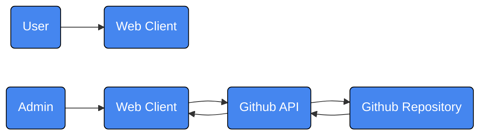

#### TODO:

- [x] Date and Time input
- [x] Add Deletion Confirmation
- [x] Server Side Error Handling
- [x] Auth setup
- [x] robots.txt
- [x] Updated favicon.ico
- [ ] opengraph-image .jpg, .png, .jpeg, .gif
- [ ] opengraph-image.alt.txt
- [ ] Data Repo and Data File Name Change
- [ ] Update Environment Variables

## NOTICE

If you need to update the environment variables in your Vercel Dashboard, you have to redeploy the site again for it to update. You can simply edit this file and update the text below this paragraph by clicking on the `pencil icon` on the top right of this section.

Last updated environment variables: March 23, 2024

# Randy Mark's Car Auction Site Design Document

## Introduction

This repository contains the source code for the Randy Mark's Car Auction Website. It is a simple website that advertises the next in-person auction hosted by Randy Mark.

## Background

Randy wants a website where he can list the next car auction he is hosting. The cars are from the State of New York. He gets permission from the Marshal's office.

## Requirements

- Users can view the upcoming auction on the homepage.
- Users can view what vehicles present at the auction.
- Users can see the date and location of the auction
- Randy can edit the information listed in the auction.

## High Level Design

### Web Client (Next.js / Vercel)

This site is built using Next.js 14.1.0 and hosted on Vercel.

### Viewing and Editing the Auction Data (Github API)

[Github's REST API for repository contents](https://docs.github.com/en/rest/repos/contents?apiVersion=2022-11-28#get-repository-content) is used for reading and writing the auction data a private repository on Github.

### Authentication and Auction Data (Github Repository)

The auction data and admin credentials are stored in JSON files in a private Github repository.

## Detailed Design

### 1. GET and POST auction data using Github API

The both the auction data and the admin data will be present in this repository.

For the end-user, the auction data will be read from this repository.

For Randy or anyone who needs to update the data, the auction data will be fetched using [Github's REST API for repository contents](https://docs.github.com/en/rest/repos/contents?apiVersion=2022-11-28#get-repository-content) since we need the SHA of the auction file.

The reason for using Github as our "database" is because of **cost**. Because the complexity of this website is very simple and the auction data is very small, we can use Github as a CMS (content management system) and avoid complications and expenses from using AWS (Amazon Web Services) or Google Cloud. For the most part, when a regular user looks at the website, the auction data is read from a json file. When an admin wants to update the auction data, we need to use Github's API to retrieve the hash (SHA) of the file so we can update it.

Currently, Randy is not interested in scalability. The Marshal's office allows him to handle only a few auctions at a time (Only auctions that will occur in the current month will be assigned to him). The Github repository is more than capable of storing that data.

Since we are using Github's API, a [PAT (personal access token)](https://docs.github.com/en/authentication/keeping-your-account-and-data-secure/managing-your-personal-access-tokens) is required for this site to function. Unfortunately, the maximum duration we can set for this token is [1 year](https://docs.github.com/en/authentication/keeping-your-account-and-data-secure/token-expiration-and-revocation#token-expired-due-to-lack-of-use). **Therefore, the personal access token must be regenerated every year.** Once the token is regenerated, the environment variable for the token must be updated in Randy's [Vercel Dashboard](https://vercel.com/docs/projects/environment-variables).

### 2. Authentication

Randy is a one-man team, so only he will update the auction data. Therefore, authentication can be simplified. A 60 minute session cookie is created when Randy logins. Once that session is created, he'll be able to edit the auction data. When that session cookie expires, he'll be required to sign in again.

## Limitations

### 1. Limited Scalability

Because we are using Github to store our auction data, there is a limit of [100 MiB](https://docs.github.com/en/repositories/working-with-files/managing-large-files/about-large-files-on-github#file-size-limits) per file. A typical JSON file representing the auction information which holds around 50 vehicle listings is around 6 - 7 KiB, which is far below the 100 MiB limit (_100 MiB \* 1,024 KiB = 102,400 KiB_).

It is unlikely that the amount of auction data will exceed this limit; however, if images or videos were to be added per vehicle, then a secondary storage for that type of media would be required.

## References

- Github API: https://docs.github.com/en/rest/repos/contents?apiVersion=2022-11-28#get-repository-content
- Github File Limit: https://docs.github.com/en/repositories/working-with-files/managing-large-files/about-large-files-on-github#file-size-limits
- Github Personal Access Token: https://docs.github.com/en/authentication/keeping-your-account-and-data-secure/managing-your-personal-access-tokens
- Vercel Environment Variables: https://vercel.com/docs/projects/environment-variables
